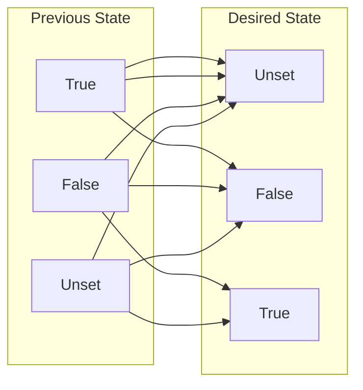

# vagrant-puppet-resource_nil_false

Vagrant environment to test Puppet custom resources failure with properties set to `unset` or `false`

#### Contents

1. [Description](#description)
1. [Pre-reqs](#pre-reqs)
1. [Usage](#usage)
    1. [Download project](#download-project)
    1. [Virtual machines](#virtual-machines)
        1. [Debian 9 VM fix](#debian-9-vm-fix)
    1. [Puppet version](#puppet-version)
    1. [Puppet execution](#puppet-execution)
1. [What to check](#what-to-check)
1. [Files and settings](#files-and-settings)

## Description

This project automates the creation of an environment to test Puppet custom resources created with low level method.

It was observed that, when such resources properties are set to `unset` or `false`, Puppet just doesn't call the properties setter functions.

This Vagrant environment includes a set of VMs with varied distros and versions, a test Puppet module with a dummy custom resource and a main manifest calling this resource.

## Pre-reqs

- Linux (recommended)
- Git
- VirtualBox
- Vagrant
    - Vagrant plugin `vagrant-vbguest`

## Usage

### Download project

If you didn't already, clone this project locally

```Shell
cd <Parent directory>
git clone https://github.com/EmersonPrado/vagrant-puppet-resource_nil_false.git
cd vagrant-puppet-resource_nil_false
```

If you already cloned, update it

```Shell
cd <Local clone dir>
git pull
```

### Virtual machines

Vagrant manages the VMs. You can query and change their statuses via `vagrant <Command> [<Options>] [VMs]`. Examples:


```Shell
# Check VMs statuses
vagrant status [ <VM spec> ]
# Turn VMs on, creating if necessary
vagrant up [ --no-provision ] [ <VM spec> ]
# Run provisioner(s) inside VMs
vagrant provision [ --provision-with=<Provisioner> ] [ <VM spec> ]
# Run shell in a VM
vagrant ssh <VM name>
# Run command in a VM (watch your quotes!)
vagrant ssh <VM name> -c <Command>
# Turn VMs off
vagrant halt [ <VM spec> ]
# Remove VMs, turning off if necessary
vagrant destroy [ <VM spec> ]
```

Where:
- VM spec: list of space-separated names and/or regular expressions to match names
    - Default: all
- `--no-provision`: don't run provisioners
- Provisioner: `shell` installs Puppet and `puppet` runs the main manifest
    - Default: all

#### Debian 9 VM fix

VM `debian-09` will fail when created, because of an incompatibility between the OS and VirtualBox Guest Additions versions. To fix it, update APT repos, then the SO, then the kernel:

```Shell
# In your host
vagrant ssh debian-09
# Inside the VM
echo 'deb http://deb.debian.org/debian stretch-backports main contrib' |
  sudo tee -a /etc/apt/sources.list > /dev/null
sudo apt-get -y update
sudo apt-get -y upgrade
sudo apt-get -yt stretch-backports install linux-{headers,image}-amd64
exit
# In your host
vagrant reload --no-provision debian-09     # Loads updated kernel
vagrant vbguest --do install -b debian-09   # Updates Guest Additions
vagrant reload debian-09                    # Loads updated Guest Additions
```

### Puppet version

You can choose a Puppet version, from 5 to 8, by changing key `:puppet_version` in `etc/global.yaml` file.
- Not all Puppet versions run in all VMs. Older Linux versions are incompatible with Puppet 8, and the newer ones, with Puppet 5.
- After changing, rerun Shell provisioner to apply the new version:

    ```Shell
    vagrant provision --provision-with=shell ] [ <VM spec> ]
    ```

### Puppet execution

It's recommended to do a specific Vagrant run only to run Puppet, what yields a smaller and cleaner log:

```Shell
vagrant provision --provision-with=puppet [ <VM spec> ]
```

Still more recommended to save the log, maybe applying some filtering. Examples with one log for each puppet version:

```Shell
# Full
vagrant provision --provision-with=puppet > puppet_$(awk '$1 == ":puppet_version:" { print $2 }' etc/global.yaml).log
# Filtered
vagrant provision --provision-with=puppet |
tee >(grep -F 'changed' > puppet_$(awk '$1 == ":puppet_version:" { print $2 }' etc/global.yaml).log)
```

## What to check

The Puppet output and, eventually, the log file(s), show what changed in what VM. The Puppet custom resource is dummy, and doesn't change anything, but it has properties `previous_state` and `desired_state`, which the Puppet main manifest alternates among `unset`, `false` and `true`, like this:



Ideally, the log should show a "changed" message for every combination where Previous State != Desired State, for every VM.

The proof of failure is the absence of "changed" messages where Desired State is `undef` or `false`, regardless of the Previous State.

## Files and settings

Most important project files and what they do:
- [Vagrantfile](Vagrantfile) - Coordinates VMs creation and configuration (provisioning)
- [etc/vms.yaml](etc/vms.yaml) - List all VMs and which box (template) each one should use
- [etc/global.yaml](etc/global.yaml) - VMs/VirtualBox/Puppet general settings
- [bin/install_puppet.sh](bin/install_puppet.sh) - Detects distro and Puppet currently installed version, validates package source and installs/updates Puppet
- [manifests/default.pp](manifests/default.pp) - Main Puppet manifest - Calls the dummy resource with all previous/desired state combinations
- [modules/resource_nil_false](modules/resource_nil_false) - Puppet module containing dummy resource
    - [modules/resource_nil_false/lib/puppet/type/setter_call.rb](modules/resource_nil_false/lib/puppet/type/setter_call.rb) - Dummy resource type
    - [modules/resource_nil_false/lib/puppet/provider/setter_call/setter_call.rb](modules/resource_nil_false/lib/puppet/provider/setter_call/setter_call.rb) - Dummy resource provider
